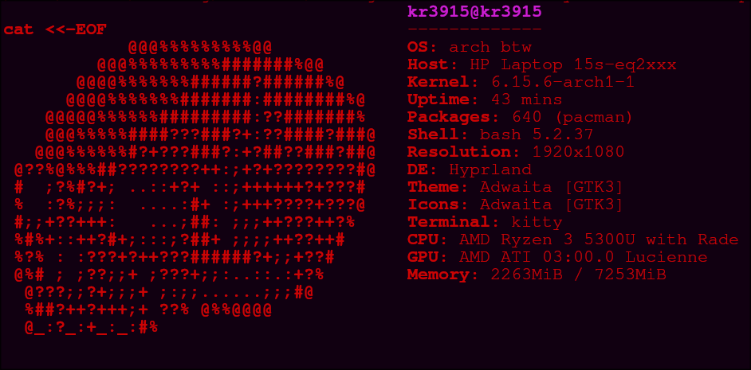

# Custom-neofetch-ascii
## Project Overview
This is my custom neofetch config with custom ascii art
## showcase

[original creator of the scull](https://github.com/adithyankv/neofetch_ascii)
# how to setup
find the image_source line in `config.conf` and insert path to your ascii txt file
bash
```
##################################
image_source="your/image/path"
#################################
```
then replace your original config in `~/.config/neofetch/config.conf` with your new config.conf once you do this you can just run `neofetch`
## Customization
Neofetch uses numbers to represent colors in its configuration. Here is a quick reference table showing which number corresponds to which color:

| Number | Color Name    |
|--------|---------------|
| 0      | Black         |
| 1      | Red           |
| 2      | Green         |
| 3      | Yellow        |
| 4      | Blue          | 
| 5      | Magenta       | 
| 6      | Cyan          | 
| 7      | White         | 

---

You can use these numbers in your Neofetch config to customize the colors of ASCII art and other elements. by changing thses two lines:

```bash
ascii_colors=(1 1 1 1 3 3)
```
and 
```bash
ascii_colors=(1 1 1 1 3 3)
```
